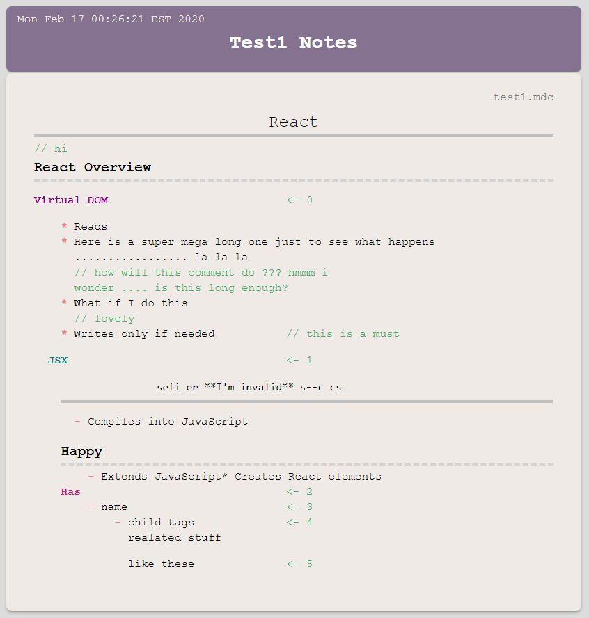

# Beautify Text Notes

Beautifies naturally written text notes to an html webpage you can take anywhere. 

## Status

This **project has is abandoned** for now due to inefficient design choices (made this in 2 days for fun)
Thinking of remaking a version 2 in the future :)

Problems and needs for improvements
* the syntax definition are not regular enough and require too much pre and post processing
* should not be using regex for parsing
* takes too many intermediate stages to produce the results
* the html results are not semantic
* too slow

## Try it out

Download and run the jar in any folder with your text notes in the .mdc extension. All files in the folder will be converted and combined into 1 beautified html page

### Settings

You can configure settings by creating a file named "./settings.mdcs" next to the jar
Examples of configurable settings are [here](./settings.mdcs)

### Syntax

[Link](./doc/syntax.txt)

## Example

mdc

```

======================== React ===========================
// hi
--------------------- React Overview ----------------------
 
Virtual DOM                                                 <- 0                                                 
    
    * Reads
    * Here is a super mega long one just to see what happens ................. la la la         // how will this comment do ??? hmmm i wonder .... is this long enough?
    * What if I do this
        // lovely
    * Writes only if needed         // this is a must

               
    JSX                                                     <- 1

                sefi er **I'm invalid** s--c cs
        --------------------------------------------------
                                                        
        - Compiles into JavaScript

        ------------------- Happy ------------------------  
            - Extends JavaScript* Creates React elements
        Has                                                 <- 2
            - name                                          <- 3
                - child tags                                <- 4
                    realated stuff

                    like these                              <- 5


```

results



## Done

Stage 0 
* nested body structure
* lists
* inline-comment

Stage 1
* rule
* headings
* Subheadings

## Todo

Make sure that things that aren't supposed to have children don't crash
when you give them some

Stage 1
- Unlined tables

Stage 2
- block-comment
- block-code
* inline-code
- plaintext
- hanging indent

Stage 3
- wrappers
- external links

Stage 4
- meta-data
- advanced format display
- optimizations ...?

## Usage

FIXME

## License

Copyright © 2020 FIXME
